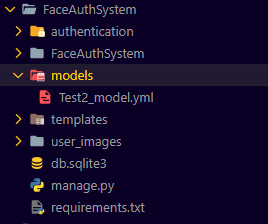

# FaceAuthSystem

FaceAuthSystem is a web-based facial authentication system designed to provide secure and convenient user access to your application.

## Installation

To get started with FaceAuthSystem, follow these steps:

1. Clone the repository to your local machine:

```bash
git clone https://github.com/Patel-Aum-28/FaceAuthSystem.git
```

2. Navigate to the project directory:

```bash
cd FaceAuthSystem
```

3. Install the required dependencies. It's recommended to use a virtual environment:

```bash
# Create a virtual environment (recommended)
python -m venv .venv

# Activate the virtual environment
# On Windows
.venv\Scripts\activate
# On macOS/Linux
source .venv/bin/activate

# Install dependencies
pip install -r requirements.txt
```

4. Run the Django migrations to set up the database:

```bash
python manage.py migrate
```

5. Start the development server:

```bash
python manage.py runserver
```

6. Access the application by visiting [http://127.0.0.1:8000/](http://127.0.0.1:8000/) in your web browser.

## Usage

1. Register Users:
   - Access the registration page and provide a username.
    
    

   - Capture 50 images of the user's face by clicking the "Register" button.
    
    

    - Model will generated and stored in `models` folder with username!
    
    

    - Success message will be displayed on successful Registration.

    

2. Log in:
   - Provide the registered username.
    
    

   - Click the "Capture Image" button to capture your image.
    
    

   - If the captured image matches the registered user's face, you'll be logged in successfully.
    
    

> [!NOTE]
> Default credential of django admin panel is `admin`/`password`.

## License

This project is licensed under the [MIT License](LICENSE).
